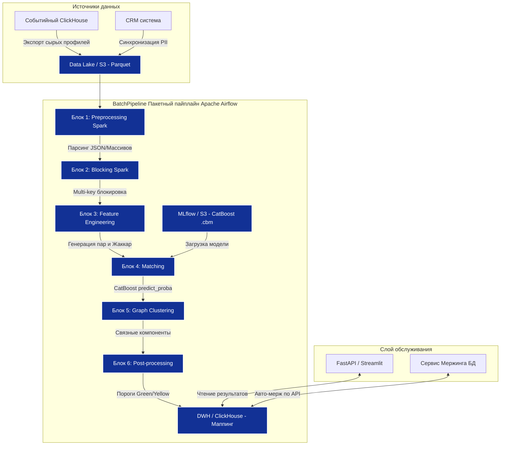

### 1. Архитектурная схема

### 2. Описание компонентов архитектуры

В текущем прототипе мы использовали `Pandas` и `NetworkX`. Для Production эта архитектура трансформируется в распределенную среду:

1. **Data Lake (S3/MinIO + Parquet):** Сырые данные профилей лежат в виде витрин в колонковом формате. Это избавляет DWH от лишней нагрузки при проведении тяжелых расчетов ER.
2. **Оркестратор (Apache Airflow):** Запускает пайплайн по расписанию (например, раз в сутки в 04:00) или по триггеру ("пришла новая выгрузка из CRM").
3. **Вычислительное ядро (PySpark):**
    - _Preprocessing:_ Распределенный `mapPartitions` вместо `pandas.apply`.
    - _Blocking:_ `Spark SQL JOIN` по домену email. Вместо генерации комбинаций в памяти, Spark делает распределенное декартово произведение внутри партиций.
    - _Feature Engineering:_ Пользовательские UDF-функции (написанные на Python) для расчета Jaccard и 3-state логики.
4. **ML Serving (MLflow + CatBoost):** Модель хранится в MLflow. В Spark модель подгружается как `SparkML Pipeline` или через `pandas_udf` для векторизованного применения к парам.
5. **Графовая кластеризация (Spark GraphX / Neo4j):** `NetworkX` не умеет работать в распределенном кластере. Мы используем встроенный в Spark алгоритм `ConnectedComponents`, который может построить граф из десятков миллионов узлов (профилей) и ребер (совпадений).
6. **Слой обслуживания (Streamlit + FastAPI):**
    - Аналитики заходят в Streamlit, чтобы визуально проверить найденные кластеры (Yellow зона).
    - Приложение бэкенда (FastAPI) берет "зеленые" кластера и дергает API основной базы данных для финального `UPDATE` (объединения ID).

---

### 3. Подход к масштабированию (Решение проблемы OOM)

В прототипе мы столкнулись с `Out of Memory` из-за квадрата числа пар O(N2). 
На реальных данных маркетплейса (например, 50 млн профилей) эта проблема критична.

**Как мы решаем это в Production:**

1. **Multi-Blocking (Многоканальная блокировка):** Мы не строим декартово произведение всего датасета. Мы делим его на микро-блоки: `[email_domain + rt_geoid_prefix]`. Пара генерируется, только если профили совпали хотя бы по 2 "быстрым" ключам. Это снижает количество пар с миллиардов до сотен тысяч.
    
2. **LSH (Locality Sensitive Hashing) для поведенческих фичей:** Вместо того чтобы считать Jaccard для всех пар внутри блока (что медленно), мы прогоняем массивы сайтов через алгоритм **MinHash LSH**. Это позволяет за доли секунды найти _только те пары_, у которых Jaccard > 0.3, без перебора остальных. (В Spark это делается через `BucketedRandomProjectionLSH`).
    
3. **Horizontal Scaling (Горизонтальное масштабирование):** Пайплайн写在 Spark集群上. Если данных стало в 2 раза больше, мы просто добавляем 2 новых воркера (ноды) в кластер. Время выполнения останется тем же.
    

---

### 4. Подход к деплою

1. **Контейнеризация (Docker):** Каждый блок пайплайна и Streamlit-приложение упаковываются в отдельные `Docker` контейнеры. Это гарантирует, что "на моей машине работает" превратится в "работает везде".
2. **Окружение (Kubernetes / Yandex DataSphere):**
    - Пайплайн разворачивается как `SparkApplication` на кластере K8s (или внутри Yandex DataSphere, где Spark уже настроен).
    - Streamlit деплоится как сервис с Ingress (проброс порта наружу).
3. **CI/CD (GitLab CI):** При `git push` в ветку `main` автоматически запускаются тесты (проверяется, что `preprocessing.py` не падает на тестовом датасете), собирается Docker-образ и деплоится на тестовый стенд.
